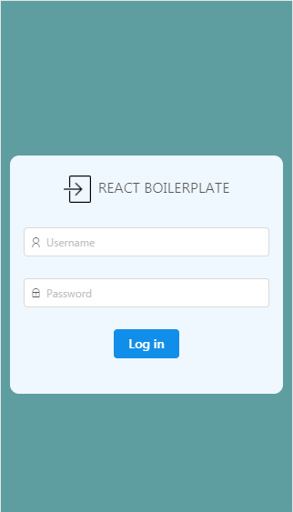
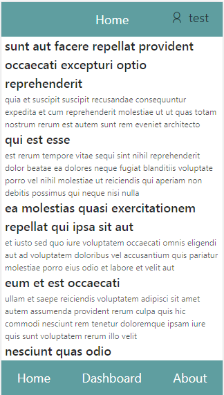

本项目是基于React官方推荐的create-react-app命令行工具创建的工程，包含了 webpack + react + react-router + redux + es6 + antd等技术，可作为开发模板使用。


##主要功能特征
- 使用react-router路由
- 使用redux进行组件间通信
- 使用热加载，文件改变页面自动刷新
- 使用 ESlint 检测 js
- 使用 Fetch请求数据
- 使用antd构建页面组件

---------

####页面效果如下：





---------


## Requirements
- [Node.js](https://nodejs.org)
- [npm](https://www.npmjs.com/)

## Usage
####安装
```
git clone https://github.com/lidaguang1989/react-boilerplate.git
cd react-boilerplate
npm install
```
####本地开发
```
// 启动本地server用于开发
npm run start
```
接口将会在本地 3000 端口启动

####生产打包
```
npm run build
```

## Linting
本项目使用 ESlint，项目开发过程中会自动检测 js
检测完毕会在命令行显示所有纠错提示


## Dependencies
- [React](https://github.com/facebook/react)
- [React-router](https://github.com/reactjs/react-router)
- [redux](https://github.com/reactjs/redux)
- [fetch](https://github.com/github/fetch)
- [antd](https://ant.design)